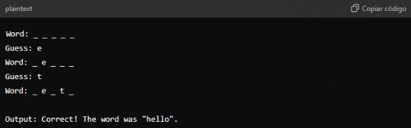
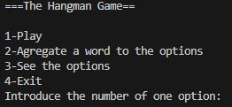
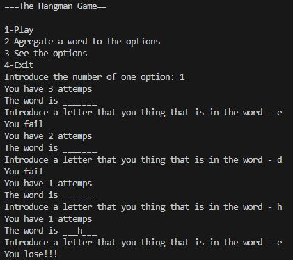
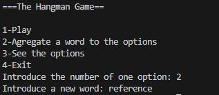
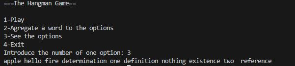
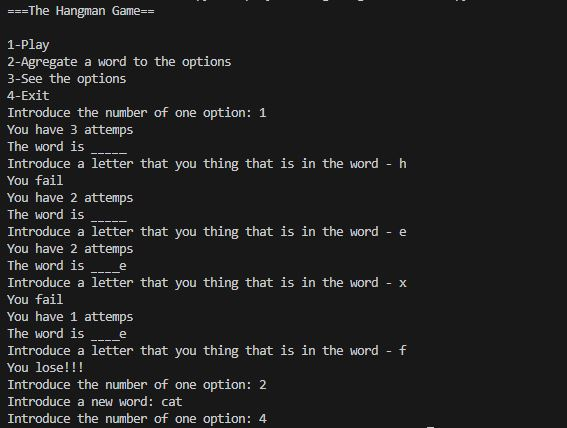

# Hangman Game

## Description

Create a hangman game where the user guesses letters to form a hidden word.

Requirements
- The program should select a random word from a predefined list.
- It should display the word with underscores for unguessed letters.
- The user should guess letters until they either guess the word or run out of attempts.

### Example

### Libraries and Tools

Random module for word selection.

### Hints

- Use a list or set to keep track of guessed letters.
- Update the display as the user makes guesses.

### Topics to Study

- Random module
- String and list operations
- Control flow

### Methodological Steps
- Select a word: Use a list of words and randomly select one using random.choice().
- Initialize game state: Track guessed letters and remaining attempts.
- User interaction: Use a loop to repeatedly ask for guesses.
- Update display: Show the word with guessed letters and underscores for missing ones.
- Check game status: Determine if the user has won or lost.

### Best Practices

- Use clear displays: Make the game state easy to understand for the user.
- Validate inputs: Ensure the user enters valid guesses (letters only).
- Encourage code reuse: Use functions to handle repetitive tasks like updating the display.

## Project

The project replie the clasic hangman game, choose a random word from those in its database, and also allows more words to be added.

**Play:**

The play option allows play with the default words.

**Agregate a word to the options:**

Allows you to add an extra word to the list of possible words (added words are kept even after the program is closed).

**See the options:**
This option print all the options of word.

**Exit**

The exit option close the program.

## Architecture

https://www.youtube.com/watch?v=VDBhk5-erp0
https://www.youtube.com/watch?v=4d_fquQ9V2M